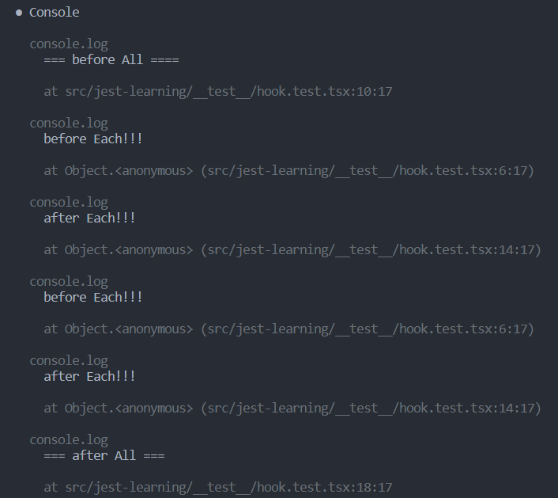

# 项目来源

[jeffersonRibeiro/react-shopping-cart](https://github.com/jeffersonRibeiro/react-shopping-cart)

# 检查 `create-react-app` 安装的包

`package.json`里面有的包一个定两,东西非常多,绝对不止这些

输入的命令
```shell
create-react-app shopping-cart --template typescript
```
安装的包
```json
  "dependencies": {
    "@testing-library/jest-dom": "^5.16.5",
    "@testing-library/react": "^13.4.0",
    "@testing-library/user-event": "^13.5.0",
    "@types/jest": "^27.5.2",
    "@types/node": "^16.18.11",
    "@types/react": "^18.0.26",
    "@types/react-dom": "^18.0.10",
    "react": "^18.2.0",
    "react-dom": "^18.2.0",
    "react-scripts": "5.0.1",
    "typescript": "^4.9.4",
    "web-vitals": "^2.1.4"
  }
```
- `typescript` ts支持
- `react`,`react-dom`,`react-scripts` react支持
- `@types` 类型的包
  [参考说明](https://jkchao.github.io/typescript-book-chinese/typings/types.html)

  `@types` 是提供给ts使用的类型声明文件,有些包使用js编写，因此我们并不知道哪些变量的类型和声明,ts无法进行类型检查

  需要看的文章
  1. [一文读懂TS的(.d.ts)文件](https://juejin.cn/post/6987735091925483551)
   
  2. [TypeScript 中的 .d.ts 文件](https://zhuanlan.zhihu.com/p/394448926)
   
- `@testing-library` 中的包是 `react` 官方推荐使用的测试库,测试环境使用 `Jest` 。
  
  当我们执行 `npm test` 的时候，Jest会自动匹配所有以 `test.js` 为后缀的文件，我们可以在Jest配置文件内自己设置匹配模式。

- [web-vitals](https://zhuanlan.zhihu.com/p/166434426)
   Google提出了一系列网站性能衡量指标,其中计算这些指标集成在了 `web-vitals` 这个包中


# 自定义hooks

[官方中文教程](https://zh-hans.reactjs.org/docs/hooks-custom.html)

# useContext and Provider

Context 提供了一个无需为每层组件手动添加 props，就能在组件树间进行数据传递的方法。

Context 设计目的是为了共享那些对于一个组件树而言是“全局”的数据，例如当前认证的用户、主题或首选语言。

如果你只是想避免层层传递一些属性，[组件组合(component composition),就是把整个组件当成参数传递下去](https://zh-hans.reactjs.org/docs/composition-vs-inheritance.html) 有时候是一个比 context 更好的解决方案。

[Context Zh-doc](https://zh-hans.reactjs.org/docs/context.html)

[useContext-doc](https://zh-hans.reactjs.org/docs/hooks-reference.html#usecontext)

**创建一个Context对象**

```js
const MyContext = React.createContext(defaultValue);
```
当React渲染一个订阅了这个Context对象的组件时,这个组件会从组件树中离自身最近的那个匹配的Provider中读取context值

只有当组件所处的树中没有匹配到 Provider 时，其 defaultValue 参数才会生效

声明一个context对象组件,并完成赋值,在内部包裹的组件可以使用这里提供的值

```js
<MyContext.Provider value={/* 某个值 */}>
```

每个 Context 对象都会返回一个 Provider React 组件，它允许消费组件订阅 context 的变化。

当 Provider 的 value 值发生变化时，它内部的所有消费组件都会重新渲染。从 Provider 到其内部 consumer 组件（包括 .contextType 和 useContext）的传播不受制于 shouldComponentUpdate 函数，因此当 consumer 组件在其祖先组件跳过更新的情况下也能更新。

`useContext` 钩子,传入一个Context对象,并返回Context的当前值
```js
const value = useContext(MyContext)
```

# useCallback

[useCallback](https://zh-hans.reactjs.org/docs/hooks-reference.html#usecallback)

返回一个[memoized](https://en.wikipedia.org/wiki/Memoization)回调函数

# 单元测试

## 介绍

使用 `create-react-app`会自带测试库 [react-testing-library](https://github.com/testing-library/react-testing-library) ,可以开箱即用


使用 `create-react-app` 创建的react应用有开箱即用的测试,基于 [Jest](https://jestjs.io/) 测试环境,只需要额外安装`react-test-renderer`来渲染快照

[tutorial-react-jest](https://archive.jestjs.io/docs/zh-hans/tutorial-react)

```shell
npm i --save-dev react-test-renderer
```

官方推荐使用的测试框架是 ,并且已经自带

[React 测试概览(官方文档)](https://zh-hans.reactjs.org/docs/testing.html)

Jest 是一个 JavaScript 测试运行器。它允许你使用 jsdom 操作 DOM 。尽管 jsdom 只是对浏览器工作表现的一个近似模拟，对测试 React 组件来说它通常也已经够用了。Jest 有着十分优秀的迭代速度，同时还提供了若干强大的功能，比如它可以模拟 modules 和 timers 让你更精细的控制代码如何执行。

## Jest基本部分

[React 单元测试入门指南](https://juejin.cn/post/6968821346088255525)

`create-react-app`的测试用例请写在`src`的`__test__`目录下,起名使用`xx.test.ts(tsx)`因此`create-react.app`内部配置是这么写的

`cra` == `create-react-app`

[cra-github参考](https://github.com/facebook/create-react-app/blob/main/packages/react-scripts/scripts/utils/createJestConfig.js)

```js
    testMatch: [
      '<rootDir>/src/**/__tests__/**/*.{js,jsx,ts,tsx}',
      '<rootDir>/src/**/*.{spec,test}.{js,jsx,ts,tsx}',
    ],
```

### 第一个测试用例

```js
describe("第一个测试用例", () => {
    test("First Test",() => {
        expect(<div></div>).toEqual(<div></div>)
    })
})
```

### `describe`

describe用来包裹一段测试的代码,通常用它来对几个测试进行分组,它自己也可以嵌套
```js
describe("test layer1" () => {
  // layer 1 test code
  describe("test layer2",() => {
    // layer 2 test code
  })
})
```

### `test`

test则是每一个测试,内部包含需要测试的方法,别名是`it`
```js
  test("test 1", () => {
    expect(1).toBe(1);
  })
```

### `expect`

expect需要个匹配器一起使用,如上面的`toBe`匹配器

expect传入我们需要执行测函数或方法或组件,后面的匹配器传入我们的预期结果

`toBe` 是直接比较,判断对象是否相等需要使用 `toEqual`

### `toBeCalled`

`toBeCalled` 判断是否被调用

### `toBeTruthy` and `toBeFalsy`

判断真假值

### `not`

 使得匹配器取反,例如

 ```js
 expect(2).not.toBe(1);
 ```

## 钩子函数

这里介绍4个函数 `beforeEach,beforeAll,afterEach,afterAll`

- `beforeEach` 在每一个test之前均会被调用
- `afterEach` 则是每一个test之后都调用
- `beforeAll` 是在所有test执行执行调用1次
- `afterAll` 是在所有test执行之后调用1次
  
```js
// hook.test.tsx
describe("钩子函数测试", () => {

    beforeEach(() => {
        console.log("before Each!!!");
    });

    beforeAll(() => {
        console.log("=== before All ====");
    });

    afterEach( () => {
        console.log("after Each!!!");
    });

    afterAll(() => {
        console.log("=== after All ===");
    });

    test("test1",() => {
        expect(1).toBe(1);
    })

    test("test2", () => {
        expect(2).toBe(2);
    })
})
export {};
```

得到如下输出



## 异步代码测试

### 从计时器开始
 代码位于 `timeout` 文件夹下

```js
// timeout.ts
export default (fn: () => void) => {
    setTimeout(() => {
        fn();
        console.log("这是timeout");
    }, 2000);
}
```
如果我们按照原来的方式写测试用例
```js
// timeout.test.js
import timeout from "./timeout";

test("测试定时器",() => {
        timeout(() => {
            expect(2 + 2).toBe(4);
        })
})
```

我们会发现测试通过,但是我们设置的回调中的打印根本没有输出,这是因为Jest的测试是不管异步代码是否执行完的,当走到最后一行没有报错就通过了

想要异步结果正常执行,我们需要传递 `done`方法,并在回调函数中执行
```js
import timeout from "./timeout";

test("测试定时器", (done) => {
        timeout(() => {
            expect(2 + 2).toBe(4);
            done();
        });
})
```

### 使用fakeTimers 提高效率

fakeTimers模拟真实的定时器,可以跳过定时,直接执行后面的代码
`const fn = jest.fn();` 是jest提供的伪造函数
```js
test("测试fakeTimers", () => {
    jest.useFakeTimers();
    const fn = jest.fn();
    timeout(fn);
    // 时间快进2000毫秒
    jest.advanceTimersByTime(2000);
    expect(fn).toHaveBeenCalledTimes(1);
})
```

### 测试异步axios请求我一直没有成功

## Jest-Mock

[Jest测试框架模拟函数mock](https://juejin.cn/post/6992124713610952735)

Mock是Jest测试框架的模拟函数

为了完成一个单元的测试,这个模块往往还需要调用其他模块的方法,但是在单元测试中,我们并不关系这个调用方法是否执行正确,我们我需要自己来模拟这个调用,从而辅助我们完成测试,这也是mock函数的作用


### `jest.fn()`

`jest.fn()`是创建`Mock`函数的最简单的方式，如果没有定义函数内部的实现,`jest.fn()` 会返回`undefined`作为返回值

```js
    test("测试 jest.fn()",() => {
        let mockFn = jest.fn();
        let result = mockFn(1,2,3);
        expect(result).toBeUndefined(); // 返回值
        expect(mockFn).toBeCalled(); // 被调用
        expect(mockFn).toBeCalledTimes(1); // 被调用一次
        expect(mockFn).toHaveBeenCalledWith(1,2,3); // 调用时传入的参数是1,2,3
    });
```

`jest.fn()` 还可以设置返回值,定义内部实现,或者是返回`Promise`对象

`expect.assertion(number)` 声明我们预期会断言几次,这个函数在异步测试中非常有用

```js
    test("测试jest.fn() 定义返回值",() => {
            let mockFn = jest.fn().mockReturnValue("mock return value");
            expect(mockFn()).toBe("mock return value");
    });

    test("测试jest.fn() 内部实现",() => {
            let mockFn = jest.fn((num1,num2) => {
                return num1 * num2;
            })
            expect(mockFn(3,4)).toBe(12);
    })

    test("测试jest.fn() 返回Promise", async () => {
        let mockFn = jest.fn().mockResolvedValue("resolved value");
        let fres = mockFn();
        
        let result = await mockFn();
        expect(result).toBe("resolved value");
        expect(Object.prototype.toString.call(mockFn())).toBe("[object Promise]");
        expect(mockFn().toString()).toBe("[object Promise]");
    });
```

### mock属性

mock包含了很多有用的值

```js
    test("查看mock属性", () => {
        const mockCallback = jest.fn(x => 88 + x);
        const forEach = <T,>(arr: T[], callback: (element: T) => T): void => {
            for (let i = 0; i < arr.length; i++) {
                callback(arr[i]);
            }
        };
        forEach([1, 2, 3], mockCallback);
        // mock函数被调用的次数
        expect(mockCallback.mock.calls.length).toBe(3);
        //第一次调用时,第一个参数是1
        expect(mockCallback.mock.calls[0][0]).toBe(1);
        // 第一次调用的第二个参数
        expect(mockCallback.mock.calls[0][1]).toBeUndefined();
        // 第一次调用的返回值是89
        expect(mockCallback.mock.results[0].value).toBe(89);
    });
```
## 测试react-hook

需要安装额外的测试hook的依赖,否则就需要我们自己把Hook放到测试组件里面进行测试

```shell
npm install --legacy-peer-deps --save-dev @testing-library/react-hooks
```

[参考](https://zhuanlan.zhihu.com/p/162878677)

# styled-compenents

  [styled-components —— React 中的 CSS 最佳实践](https://zhuanlan.zhihu.com/p/29344146)
  [官方网站](https://styled-components.com/)


styled-compenents使用es2015中的语法新特性构建(标签模板字面量)

## 安装

```shell
  npm install --save styled-components
  npm install --save-dev @types/styled-components # 安装声明文件
```

查看我写的[示例项目](https://github.com/GuiQuQu/My-styled-components-usages)可以了解 `styled-compenents` 的写法


